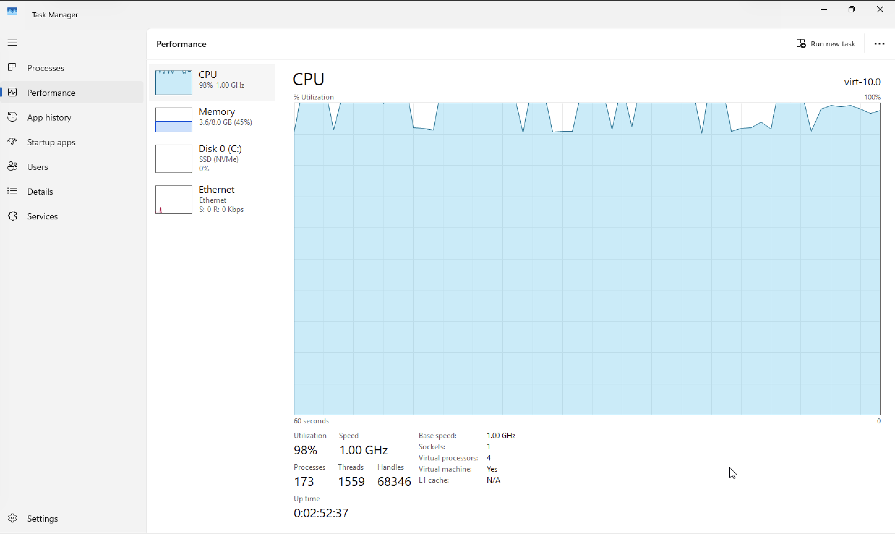
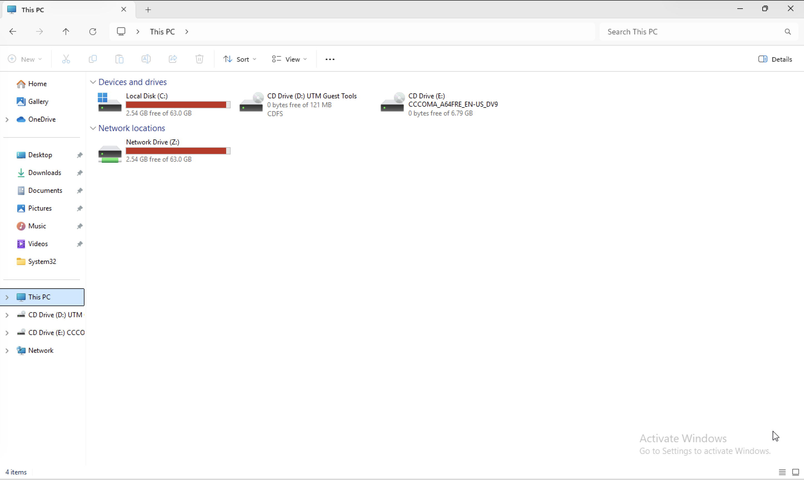

# Tier-1 Helpdesk Incident Response Lab

Hands-on Windows troubleshooting scenarios documented like real helpdesk tickets.

Each incident demonstrates the full workflow used by Tier-1 support:

**Problem → Investigation → Root Cause → Resolution → Verification**

---

# Incident Library

## DNS Resolution Failure
System could not resolve domain names due to incorrect DNS configuration.

[View Incident](incidents/incident-01-dns-resolution-failure.md)

---

## Windows Service Failure (Print Spooler)
Printing stopped because the Print Spooler service was not running.

[View Incident](incidents/incident-02-windows-service-failure.md)

---

## High CPU Usage
System performance degraded due to a runaway PowerShell process consuming CPU resources.

[View Incident](incidents/incident-03-high-cpu-usage.md)

---

## Low Disk Space
System drive reached critical capacity preventing application installation.

[View Incident](incidents/incident-04-disk-space-full.md)

---

# Skills Demonstrated

- Tier-1 troubleshooting methodology
- DNS troubleshooting
- Windows service management
- Task Manager performance diagnostics
- Disk capacity investigation
- Root cause analysis
- Incident documentation
