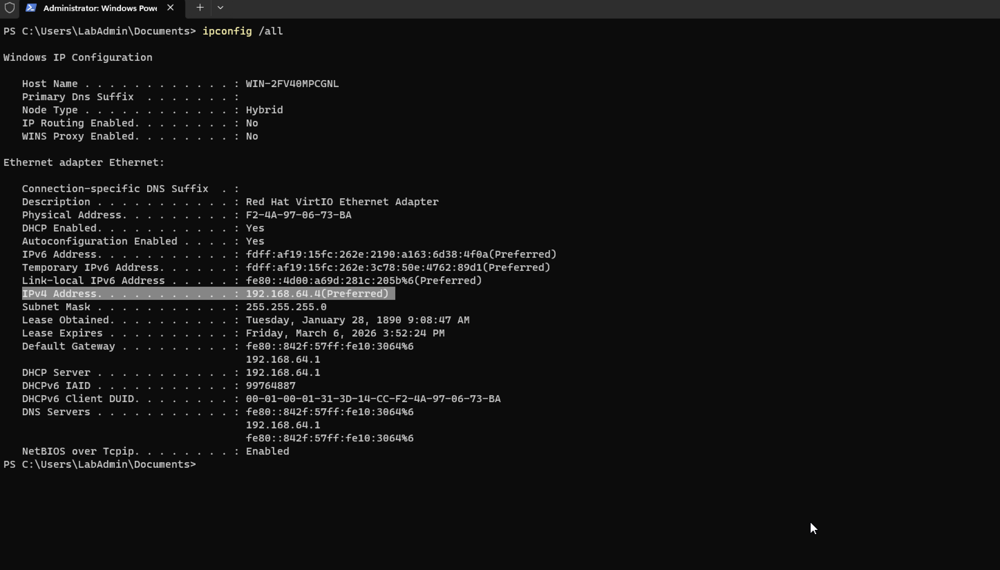

# Incident 01 — DNS Resolution Failure

## Ticket Summary
User reports that websites and internal services cannot be reached.

## Symptoms
- Internet appears connected
- Websites fail to load
- Name resolution errors

## Investigation
Initial checks performed:

- Verified network connectivity
- Checked IP configuration
- Tested DNS resolution using `nslookup`

Command executed:

```powershell
nslookup microsoft.com
```

## Root Cause
Incorrect DNS server configuration prevented hostname resolution.

## Resolution
DNS server configuration corrected on the workstation network adapter.

DNS resolution tested again to confirm successful hostname lookup.

User confirmed websites and services were accessible.

## Evidence

### DNS Resolution Failure

DNS lookup fails due to incorrect DNS configuration.


### DNS Resolution Restored

After correcting DNS settings, hostname resolution succeeds.


