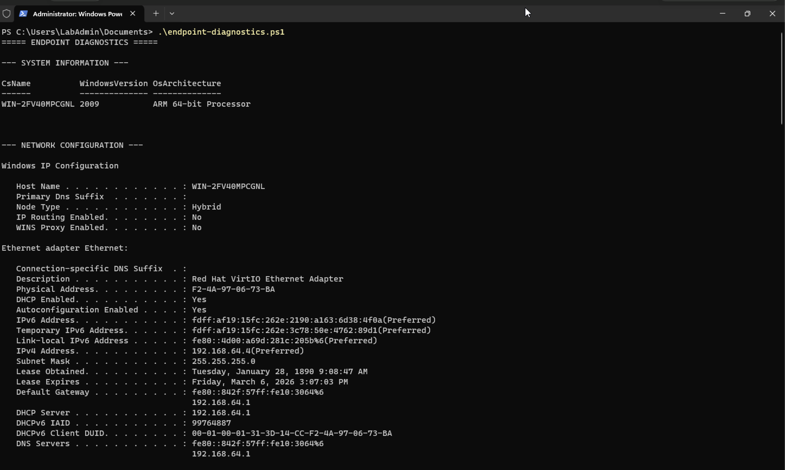
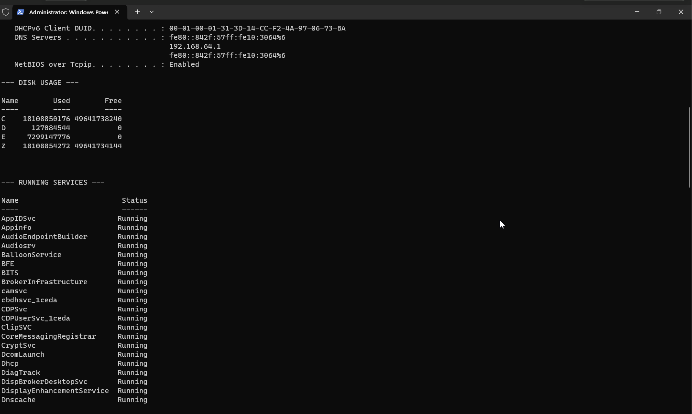
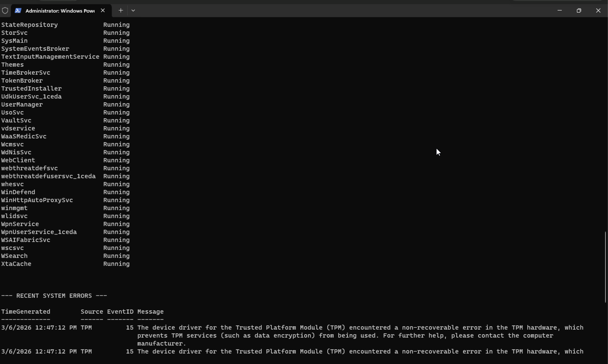
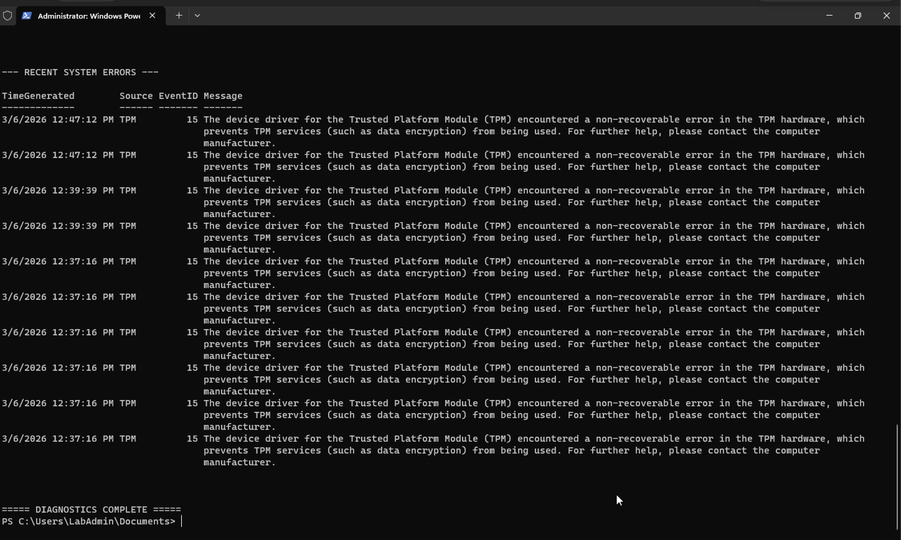

# Incident 01 — Login Failure

## Ticket Summary
User unable to log into Windows workstation.

## Symptoms
- Login attempt fails
- User reports correct password
- Access to workstation blocked

## Investigation
Initial checks performed:

- Verified workstation operational status
- Checked network configuration
- Collected endpoint diagnostics using PowerShell script

Command executed:

```powershell
.\endpoint-diagnostics.ps1
```

## Root Cause
User account authentication issue causing login failure.

## Resolution
Password reset performed and login verified successfully.

User confirmed access restored.

## Diagnostics Evidence

Diagnostics script collected:

- System information
- Network configuration
- Disk usage
- Running services
- Recent system errors

### Screenshot Evidence

System diagnostics script execution:



Network configuration and environment data collected:



Running services enumeration:


Additional service state verification:



Recent system errors reviewed from event logs:


