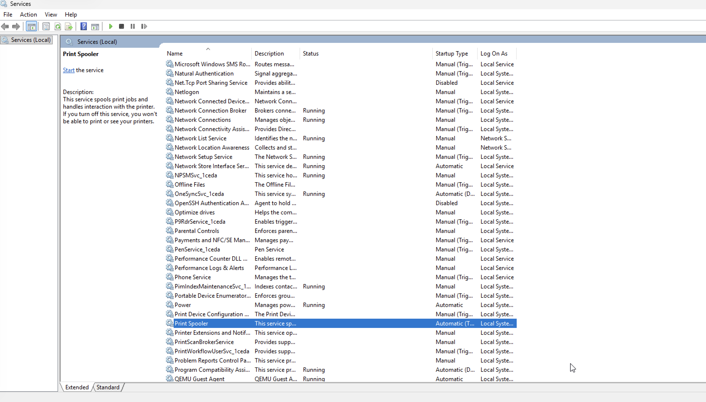
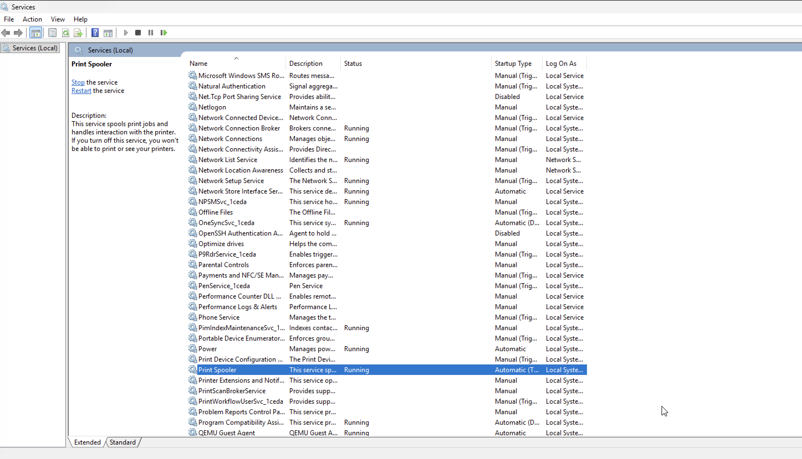

# Incident 02 — Windows Service Failure

## Ticket Summary
User reports that printing functionality is unavailable on the workstation.

## Symptoms
- Printer jobs remain stuck in queue
- Printing fails
- Printer appears online but not responding

## Investigation
Initial checks performed:

- Verified printer connectivity
- Checked Windows services
- Identified Print Spooler service status

Command executed:

```
services.msc
```

## Root Cause
The **Print Spooler service was stopped**, preventing the system from processing print jobs.

## Resolution
The Print Spooler service was restarted.

Printing functionality restored and printer jobs processed normally.

## Evidence

### Service Failure

Print Spooler service observed in **stopped state**.



### Service Restored

Print Spooler service **running after restart**, restoring printing functionality.


